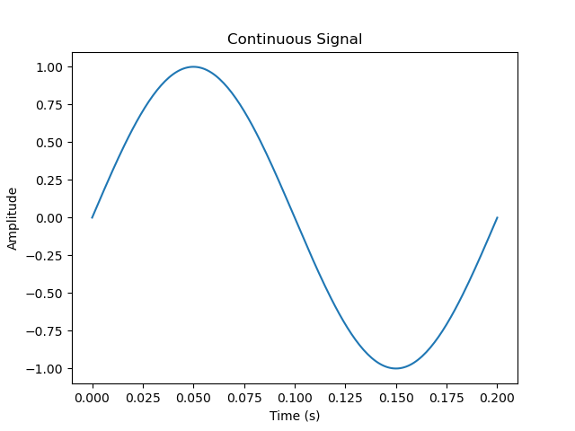
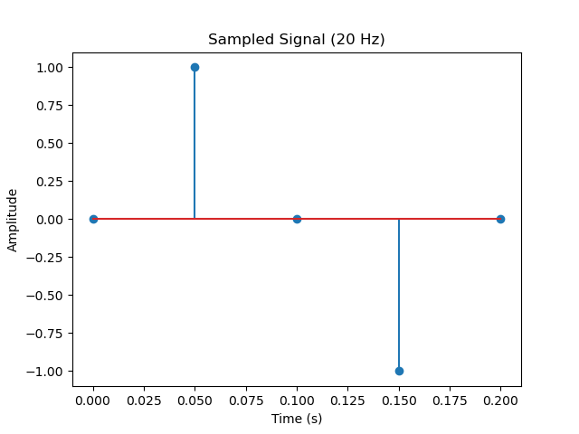
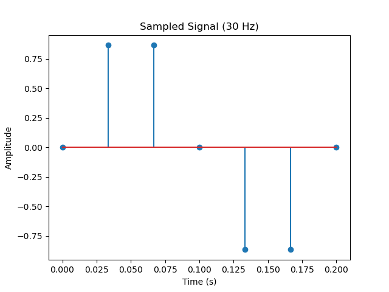
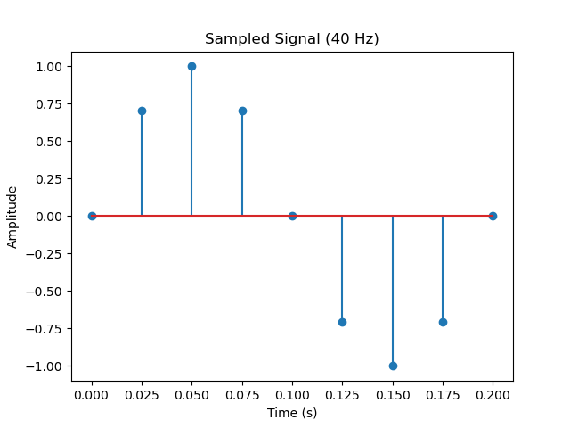
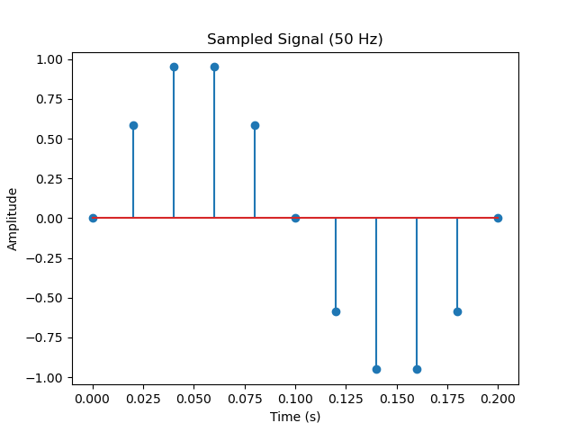
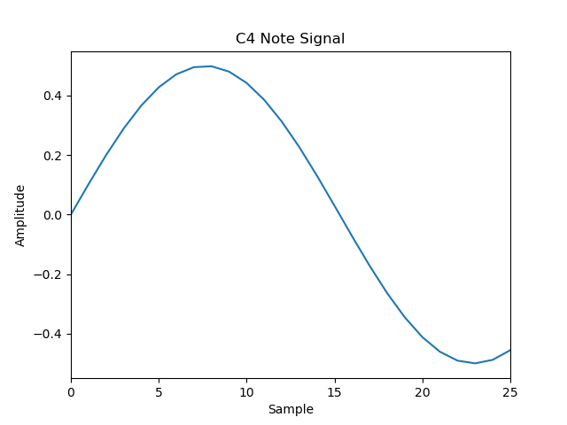

# C1 正弦信号的抽样与乐音构建

### 正弦信号抽样代码

```python
import numpy as np  
import matplotlib.pyplot as plt  
# 信号参数  
f_continuous = 5.0  # 连续信号的频率  
duration = 0.201  # 信号的时长（秒）  
  
# 抽样频率列表  
sampling_rates = [20, 30, 40, 50]  
  
# 时间范围  
t_continuous = np.arange(0, duration, 1 / 1000)  # 连续信号的时间范围  
  
# 创建一个函数，用于生成正弦信号  
def generate_continuous_signal(frequency, t_continuous):  
    return np.sin(2 * np.pi * frequency * t_continuous)  
# 画图  
  
# 绘制连续信号  
plt.plot(t_continuous, generate_continuous_signal(f_continuous, t_continuous), label='Continuous Signal')  
plt.title('Continuous Signal')  
plt.xlabel('Time (s)')  
plt.ylabel('Amplitude')  
plt.show()  
  
# 绘制离散信号  
for i, rate in enumerate(sampling_rates):  
    t_discrete = np.arange(0, duration, 1 / rate)  # 离散信号的时间范围  
    plt.plot()  
    plt.stem(t_discrete, generate_continuous_signal(f_continuous, t_discrete), label=f'Sampled Signal ({rate} Hz)')  
    plt.title(f'Sampled Signal ({rate} Hz)')  
    plt.xlabel('Time (s)')  
    plt.ylabel('Amplitude')  
    plt.show()
```

生成频率为 $10Hz$ 的连续信号，使用不同抽样频率对其进行抽样，原图像与抽样后图像如下：

#### 原图像



#### 20Hz 抽样



#### 30Hz 抽样



#### 40Hz 抽样



#### 50Hz 抽样



得出结论：**抽样频率越高，离散信号对连续信号的表示越准确.**

### 乐音构建代码

```python
import numpy as np  
import matplotlib.pyplot as plt  
import simpleaudio as sa  
  
duration = 1  # 信号的时长（秒）  
def generate_piano_note(frequency, duration, sampling_rate):  
  t_discrete = np.arange(0, duration, 1 / sampling_rate)  
  note_signal = 0.5 * np.sin(2 * np.pi * frequency * t_discrete)  
  return note_signal  
  
  
# 钢琴音符频率  
piano_notes = {'C4': 261.63, 'D4': 293.66, 'E4': 329.63, 'F4': 349.23, 'G4': 392.00, 'A4': 440.00, 'B4': 493.88}  
  
for selected_note in piano_notes.keys():  
  # 选取一个音符  
  selected_frequency = piano_notes[selected_note]  
  
  # 生成并播放音符信号  
  note_signal = generate_piano_note(selected_frequency, duration, 8000)  
  play_obj = sa.play_buffer((note_signal * 32767).astype(np.int16), 1, 2, 8000)  
  play_obj.wait_done()  
  
  if selected_note == 'C4':  
    # 绘制音符信号波形图  
    plt.plot(note_signal)  
    plt.title(f'{selected_note} Note Signal')  
    plt.xlabel('Sample')  
    plt.ylabel('Amplitude')  
    plt.xlim(0, 25)  
    plt.show()
```

安装对应库后，程序运行时可以自动播放出 C4-B4 音高的乐音，C4 的波形如下：


